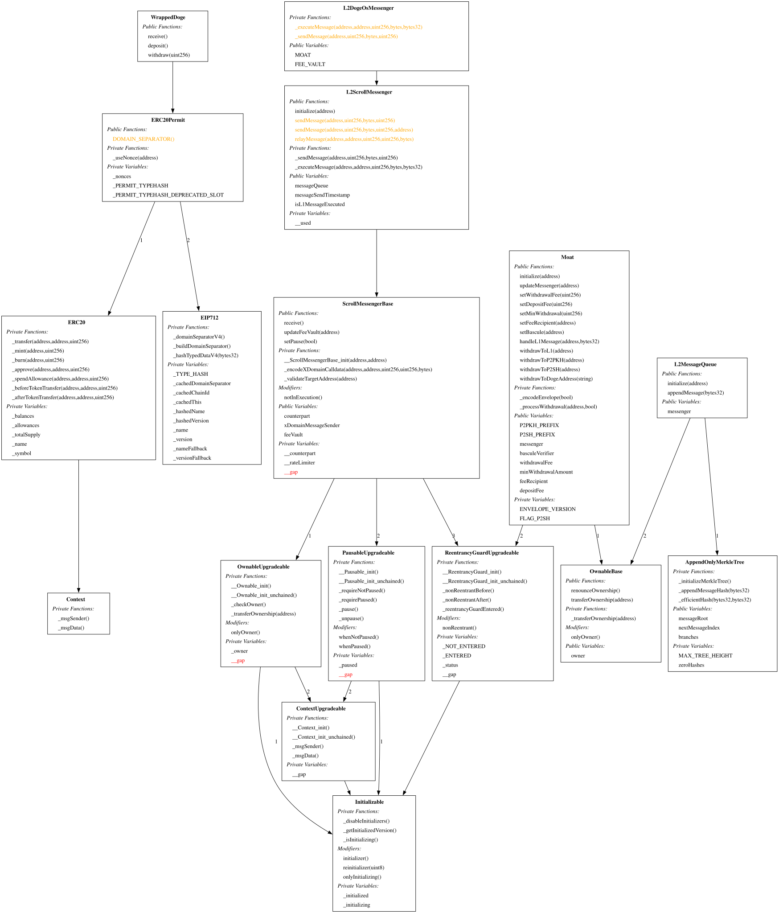
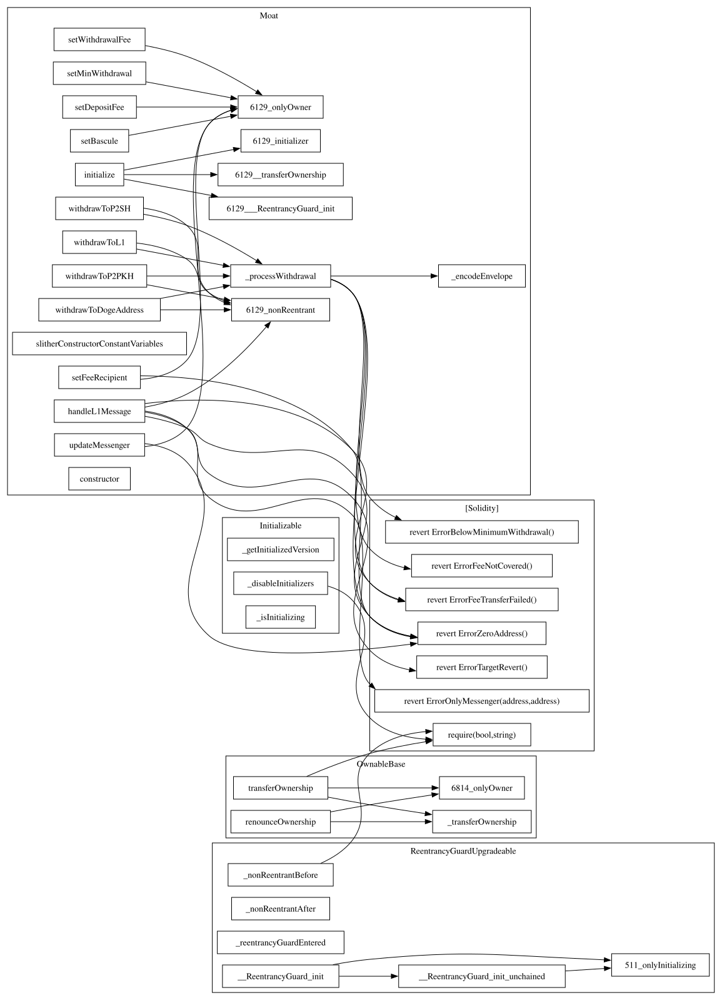
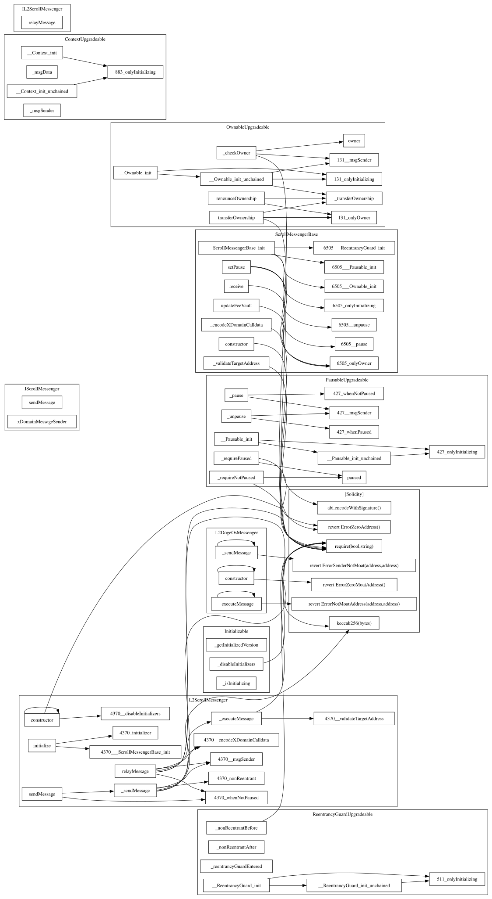

# DogeOS Documentation

Documentation for the DogeOS smart contracts - Dogecoin-native L2 bridge extending Scroll.

## Contents

| Document                                   | Description                                                     |
| ------------------------------------------ | --------------------------------------------------------------- |
| [ARCHITECTURE.md](./ARCHITECTURE.md)       | Contract hierarchy, inheritance, data flows, Scroll integration |
| [SPEC.md](./SPEC.md)                       | Message envelope format, entry points, network configuration    |
| [SECURITY_REVIEW.md](./SECURITY_REVIEW.md) | Security audit findings for P2SH withdrawals feature            |

## Diagrams

### Contract Inheritance Hierarchy

Shows how DogeOS contracts extend Scroll's base contracts.



### Moat Call Graph

Function call relationships within the core Moat contract.



### L2DogeOsMessenger Call Graph

Function call relationships in the restricted messenger.



## Source Files

| File                                | Format | Description                     |
| ----------------------------------- | ------ | ------------------------------- |
| `.inheritance-graph.dot`            | DOT    | Source for inheritance diagram  |
| `.Moat.call-graph.dot`              | DOT    | Source for Moat call graph      |
| `.L2DogeOsMessenger.call-graph.dot` | DOT    | Source for messenger call graph |

## Regenerating Documentation

```bash
# Generate Slither analysis (from project root)
slither src/dogeos/ --print inheritance-graph
slither src/dogeos/ --print call-graph

# Move DOT files
mv src/dogeos/.*.dot docs/dogeos/

# Regenerate images
cd docs/dogeos
dot -Tsvg .inheritance-graph.dot -o inheritance-graph.svg
dot -Tsvg .Moat.call-graph.dot -o moat-call-graph.svg
dot -Tsvg .L2DogeOsMessenger.call-graph.dot -o messenger-call-graph.svg
```

## Contracts Location

Source contracts: [`src/dogeos/`](../../src/dogeos/)
